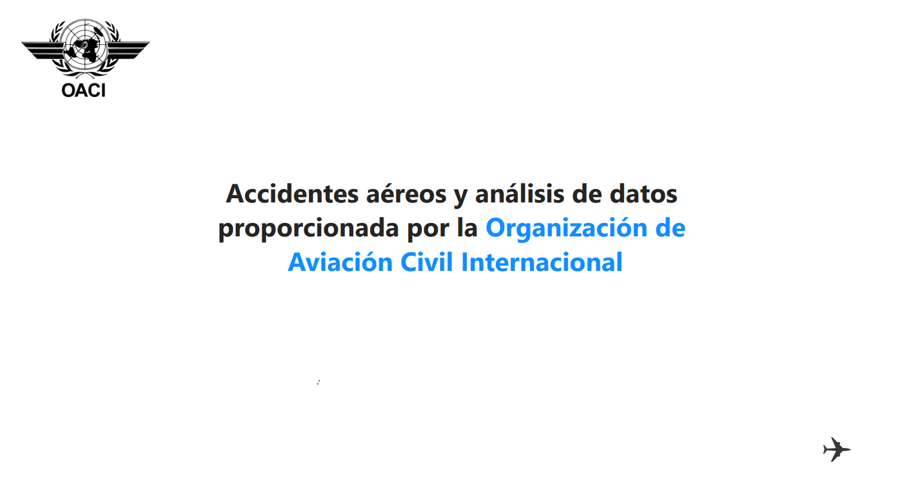
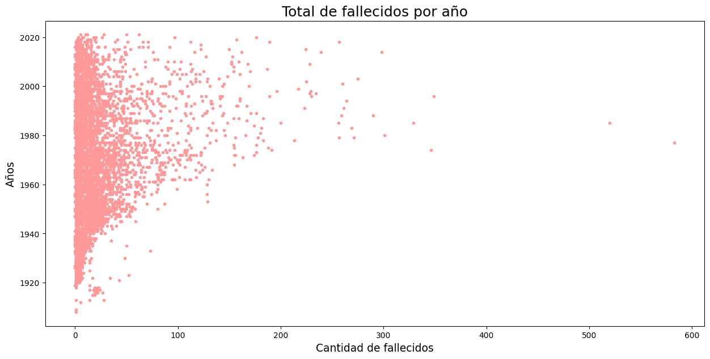
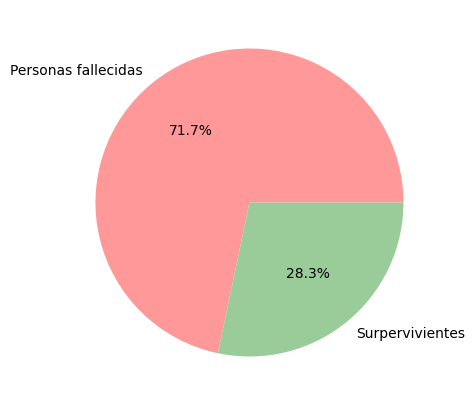
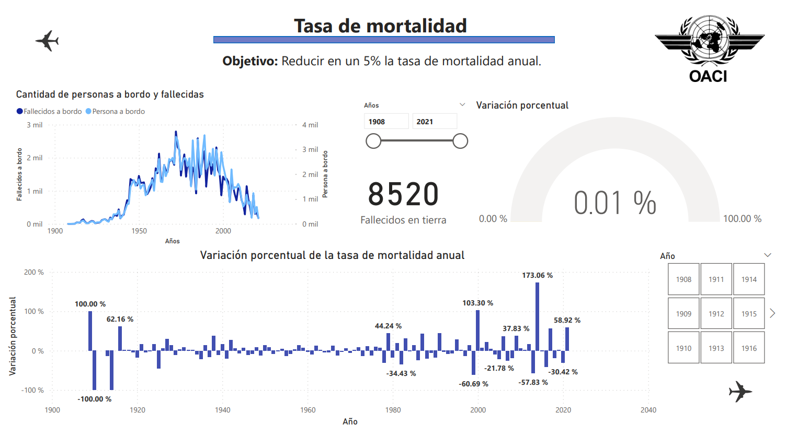
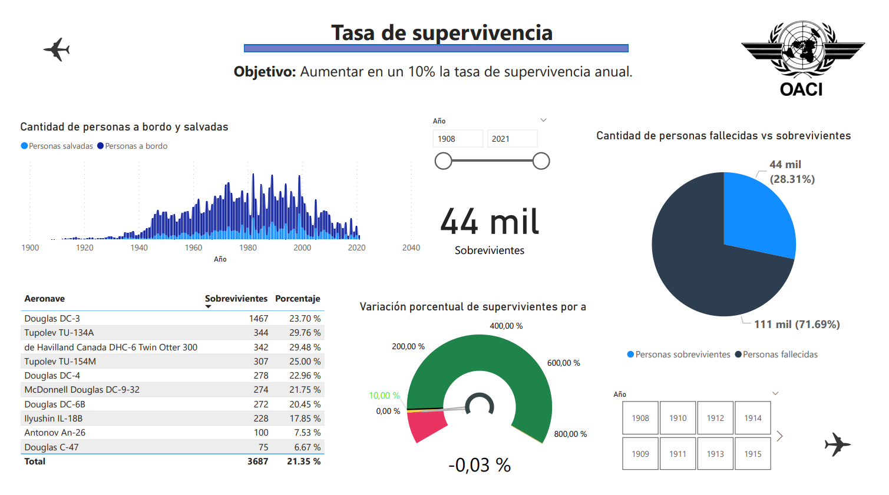

<h1 align='center'>
 <b>PROYECTO INDIVIDUAL Nº2</b>
</h1>
 
# <h1 align="center">**`Accidentes aéreos`**</h1>

## **Desarrollado por Jesús Arteaga Vela**

## **Contexto**

Los accidentes aéreos son sucesos imprevistos y impactantes, ya que contradicen las expectativas asociadas al considerarse el medio de transporte más seguro del mundo. Sin embargo, su ocurrencia puede atribuirse a diversos factores, como errores humanos, fallos en los equipos, condiciones meteorológicas desfavorables, problemas de mantenimiento, deficiencias en la gestión del tráfico aéreo, fallos de diseño o inconvenientes en la fabricación. Estas circunstancias pueden resultar en pérdidas humanas y económicas significativas.

Es por eso que la industria de la aviación, en conjunto con las autoridades reguladoras y los investigadores, trabajan incansablemente para mejorar la seguridad aérea y prevenir futuros accidentes.

En este sentido, el análisis de datos históricos de accidentes aéreos desempeña un papel fundamental en la mejora de la seguridad de la aviación. La recopilación y el análisis sistemático de estos datos permiten a los investigadores identificar patrones, tendencias y factores contribuyentes que podrían impulsar mejoras en la seguridad. Esto abarca desde la mejora de la capacitación de los pilotos y el personal de mantenimiento, hasta el perfeccionamiento del diseño y la fabricación de aeronaves y equipos de aviación.

## **Rol a desarrollar**

La **Organización de Aviación Civil Internacional (OACI)**, ha decidido llevar a cabo un proyecto de data analytics para analizar los accidentes aéreos de aviones en todo el mundo.

El propósito de este proyecto consiste en reunir, examinar y representar de manera visual datos pertinentes sobre incidentes aéreos con el fin de detectar pautas y tendencias relacionadas con la seguridad de la aviación civil. La ejecución de este proyecto se basará en la aplicación de técnicas de análisis de datos, con el objetivo de procesar y analizar la información recopilada de accidentes aéreos.

Para llevar a cabo el proyecto, la Organización de Aviación Civil Internacional (OACI) proporciona los datos de accidentes de aviones,[AcidentesAviones.csv](https://github.com/jarteaga97/PI02_Analytics_Arteaga/tree/main/datasets).

El resultado final del proyecto es un panel de control interactivo, [PI_Analytic2.pbix](https://github.com/jarteaga97/PI02_Analytics_Arteaga/blob/main/PI_Analytic2.pbix), este permite tener información sobre accidentes específicos. Este panel de control será utilizado para presentar los hallazgos derivados del análisis de la información.

Así mismo en este trabajo, se visualizará en el panel de control los siguiente indicadores claves de rendimiento (KPI), con el objetivo de comprender los datos y alinearse con los objetivos de la organización:

+ Reducir en 5% la tasa de mortalidad a nivel anual, siendo la tasa el número de fallecidos en los accidentes aéreos sobre el total de personas a bordo en los vuelos involucrados.

$$ d = (D/T)*1000$$

donde:

d : Tasa Bruta de Mortalidad  
D : Cantidad de defunciones ocurridas en el año  
T : Cantidad de personas que participaron a bordo de los vuelos 

La tasa multiplicada por mil, representa la frecuencia relativa con la que ocurren las defunciones en una población durante un año.

+ Aumentar en 10% la tasa de supervivencia a nivel anual, siendo la tasa el número de supervivencia en los accidentes aéreos sobre el total de personas a bordo en los vuelos involucrados.

$$ s = (S/T)*1000$$

donde:

s : Tasa Bruta de Supervivencia  
S : Cantidad de sobrevivientes ocurridas en el año  
T : Cantidad de personas que participaron a bordo de los vuelos 

La tasa multiplicada por mil, representa la frecuencia relativa con la que se salvan las personas en una población durante un año.

## **Propuesta de trabajo**

#### `Proceso de "ETL"` _(Extract, transform, load)_ en VisualStudioCode - Python:

+ Importar librerías y dataset.
+ Eliminar la columna 'Unnamed: 0', no aporta información relevante.
+ Pasar a formato minusculas todas las columnas.
+ Renombrar las columnas, previo al análisis.
+ Observar nulos y duplicados
+ Adecuar al formato de 24 horas la columna 'hora_declarada'
+ Eliminar las columnas 'numero_de_vuelo','registro','serie_o_fuselaje','resumen'.
+ Eliminar las coolumnas 'pasajeros','tripulacion', 'pasajeros_fallecidos','tripulacion_fallecida', previo análisis.

#### `Análisis Exploratorio de los datos` (_Exploratory Data Analysis = EDA_)

+ Explorar la frecuencia de los datos de las columnas 'lugar_impacto', 'operador', 'ruta'
+ Crear una columna 'anio', para el análisis de incidencia de accidentes anuales.
+ Graficar total de accidentes por año.

+ Graficar total de fallecidos por año.

+ Crear la columna 'supervivientes', como diferencia entre personas a bordo menos las personas fallecidas.
+ Grafica de personas fallecidas vs las supervivientes.

+ Graficar total de personas fallecidas por modelo de aeronave.

+ Guardar el nuevo dataset con las transformaciones.

#### *Nota: La extracción de datos así como las respectivas transformaciones pueden verse desarrolladas en el archivo ([ETL-EDA.ipynb](https://github.com/jarteaga97/PI02_Analytics_Arteaga/blob/main/ETL-EDA.ipynb))*

#### `Dashboard` en Power BI

+ Desarrollo del primer KPI, `Tasa de mortalidad`, con el objetivo de reducir en un 5% la tasa de mortalidad de manera anual.

Para el primer objetivo, presento distintas visualizaciones que nos brindan información sobre el comportamiento de las personas a bordo, las fallecidas y su variación porcentual año a año.

Gráficas de líneas, tarjetas, gráfica de columnas apiladas, con una segmentación dispuesta por rango, el cual muestra el comportamiento de la variación porcentual de la tasa de mortalidad en un determinado periodo de tiempo.

Medidor con alarma, el cual posee una métrica que indica cuando se está cumpliendo el objetivo y cuando los valores de variación porcentual son malos, con una escala de colores de verde, amarillo y rojo.

+ Desarrollo del segundo KPI, `Tasa de supervivencia`, con el objetivo de aumentar en un 10% la tasa de supervivencia anual.

Para este segundo objetivo, presento métricas que ayudan visualmente a comprender el comportamiento de las personas que se salvaron comparadas con las que estuvieron a bordo, además de tarjetas, gráfico de pastel, una tabla que se modifica por segmentacion en un rango temporal y brinda un top 10 de sobreviviemtes por modelo de aeronave y el porcentaje que esto representa en comparación con todas las personas a bordo, además de un termómetro que se modifican por segmentación mosaica para observar la variación porcentual de supervivientes por año.

#### *Nota: La extracción de datos así como las respectivas transformaciones pueden verse desarrolladas en el archivo ([PI_Analytic2.pbix](https://github.com/jarteaga97/PI02_Analytics_Arteaga/blob/main/PI_Analytic2.pbix))*
